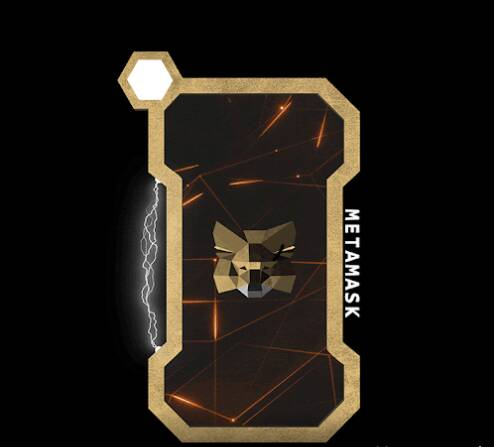

# Meta Cards

▶ 什么是元卡？
Meta Cards 是一个 NFT（不可替代令牌）集合。 存储在区块链上的数字艺术品集合。
▶ 存在多少 Meta Cards 代币？
总共有 36 个 Meta Cards NFT。 目前，69 位所有者的钱包中至少有一张 Meta Cards NTF。
▶ 最近卖出了多少张元卡？
过去 30 天内共售出 0 张 Meta Cards NFT。NFT 统计数据为您提供有关 NFT 空间的最新信息。 如果您想找到最好的 NFT 购买、即将推出的 NFT 项目、最昂贵的 NFT 是什么——我们将为您提供您需要的数据、图表、见解和新闻。
本站数据来自各个 NFT 市场和 NFT 项目创建者自己

