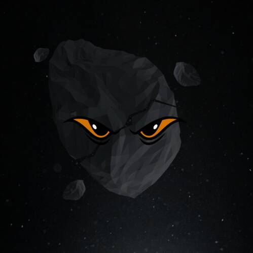

# Meta Element Collection

 MINT HERE 由 1 位法国艺术专家和 3 位游戏区块链开发人员收集的有限 NFTs，Meta Element Suit 运动即将升级到另一个级别。 一个独家社交俱乐部，提供各种福利，包括 alpha、现实世界的实用程序、游戏等。▶ 什么是元元素集合？
Meta Element Collection 是一个 NFT（Non-fungible token）集合。 存储在区块链上的数字艺术品集合。
▶ 存在多少元元素集合代币？
总共有 160 个元元素集合 NFT。 目前，71 位所有者的钱包中至少有一个 Meta Element Collection NTF。
▶ 元元素合集最近卖出了多少？
过去 30 天内售出 0 个 Meta Element Collection NFT。

