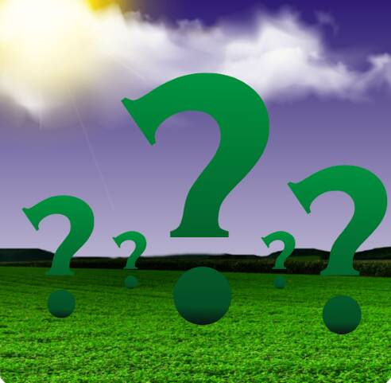

# Meta Farm Lands

Meta Farm Lands 是 10,000 个可种植的 Meta Lands 的集合。 每块土地都包含特定数量的树木，这决定了您可以通过农业生产的 $MEFV 水果数量。 $MEFV 水果每周作为 $MEFV 代币返还给持有者。 它建立在多边形区块链之上，是 Meta Farm Verse 的官方 NFT。 每个持有人还有权在 Meta Farm Verse Staking 平台上以 212121% 的年 APR 进行 Staking。▶ 什么是 Meta Farm Lands？
Meta Farm Lands 是一个 NFT（非同质代币）集合。 存储在区块链上的数字艺术品集合。
▶ 存在多少 Meta Farm Lands 代币？
总共有 4 个 Meta Farm Lands NFT。 目前 2 位所有者的钱包中至少有一个 Meta Farm Lands NTF。
▶ 最近出售了多少 Meta Farm Lands？
过去 30 天内售出 0 个 Meta Farm Lands NFT。

