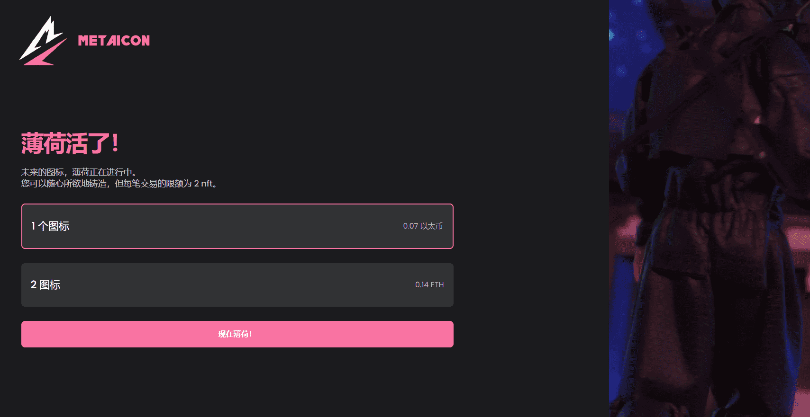

# Meta Icon

META ICON 代表着激发世界时尚产业的创意能量、缪斯和标志，并即将成为虚拟世界的主打产品。

未来的图标，薄荷正在进行中。您可以随心所欲地铸造，但每笔交易的限额为 2 nft。

Meta Icon 是一个 NFT 项目，由 1111 个独特的图标组成。他们每个人都以自己的方式独一无二，并按稀有程度对其进行分类。它们代表着激发世界时尚产业的创意能量、缪斯和标志。

这些图标是社交和数字活跃的消费者。但更重要的是，它们是活生生的，非常真实。这将使奢侈品牌有可能在元界中立足并茁壮成长。

