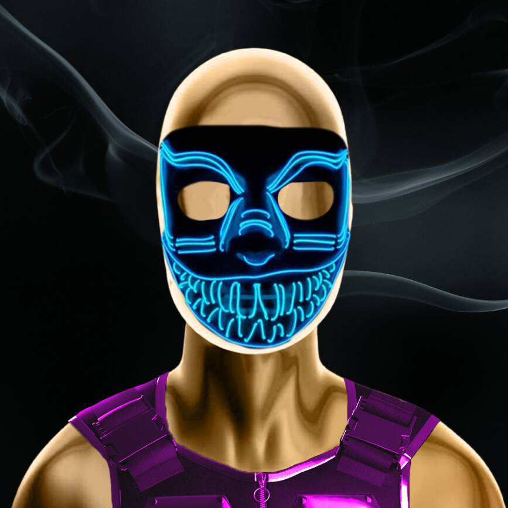

# Meta Masks NFT Collection

欢迎来到 Meta Masks NFT，它拥有 6,666 个随机生成的面具，为以太坊区块链提供匿名性。▶ 什么是 Meta Masks NFT 收藏？
Meta Masks NFT Collection 是一个 NFT (Non-fungible token) 集合。 存储在区块链上的数字艺术品集合。
▶ 存在多少 Meta Masks NFT Collection 代币？
总共有 749 个 Meta Masks NFT Collection NFT。 目前，314 位所有者的钱包中至少有一个 Meta Masks NFT Collection NTF。
▶ Meta Masks NFT Collection 最近卖出了多少？
过去 30 天内共售出 0 个 Meta Masks NFT Collection NFT。
▶ 有哪些流行的 Meta Masks NFT Collection 替代品？
许多拥有 Meta Masks NFT Collection NFT 的用户还拥有 Good Eggs Genesis、Wall St Bulls Interns、Save the Martians 和 TIMEPieces x Robotos。
  交互式 NFT 项目：Goofball Gang。 立即购买。

