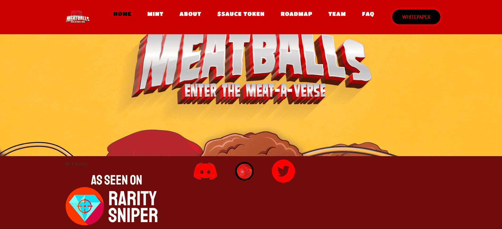

# Meta-Meatballs

Meta-Meatballs 是 8,888 种独特的特许权使用费和利润分享游戏 NFT，可用于 Meta-Meatball Meat-a-verse 和独家活动的会员资格。大多数肉丸都是贪婪的自恋者，每个肉丸都有自己的权利，可以滴入 swagu、收集酱汁、获得奖励，而且看起来很酷。元肉丸已经从桌面上滚下来，进入了拥有独特资产和特征的加密空间，所以没有肉丸是完全相同的。所以，抓住你未来最好的新芽肉丸，让我们开始滴水并进入肉节。

人类用尽了所有的食物资源，开始了创造食物繁殖乌托邦以拯救人类的使命。经过多年的努力，濒临灭绝的科学家们，使用先进的人工智能终于成功了！先进的食物增殖是成功的；然而，事情开始变得非常诡异……

多年后，被其能源背叛的所有人类都被俘虏并奴役。但不知何故，并不是所有的希望都失去了。肉丸生来就对人类怀有无法解释的忠诚和使命感。尽管肉丸本身大多是贪婪和自私的，但他们的使命是将人类从邪恶的蛆虫中解救出来，并肩负着解开它们自身存在的无法解释的谜团以及它们对人类奇怪的天生忠诚的原因的使命。

