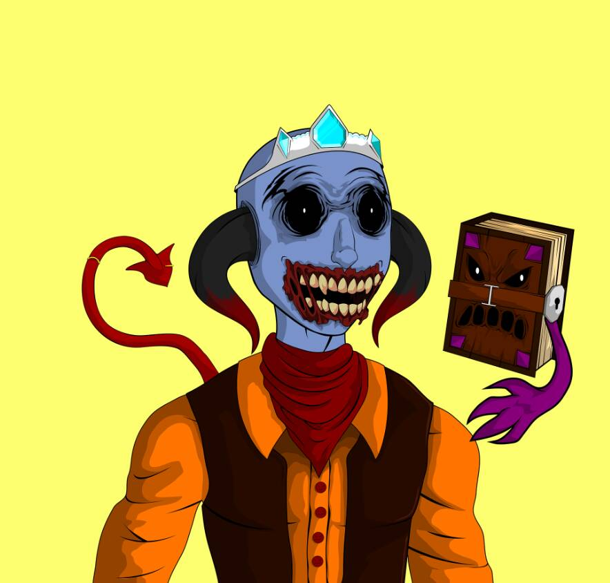

# Meta Monsters | MM

元怪物是 1500 种独特且稀有的 NFT，由数十种可怕的特征生成。 每一张都是你参加一年一度的 Monster Mash 的门票——这是一场虚拟世界中的邪恶万圣节派对，里面充满了独家赠品、内容等等。 它们作为 ERC-721 令牌存储在以太坊区块链上并托管在 IPFS 上。▶ 什么是元怪物 | 毫米？
元怪物 | MM 是一个 NFT（Non-fungible token）集合。 存储在区块链上的数字艺术品集合。
▶ 有多少元怪物 | MM代币存在吗？
总共有 1,500 个元怪物 | MM NFT。 目前 284 位拥有者至少拥有一个 Meta Monsters | MM NTF 在他们的钱包里。
▶ 有多少元怪物 | MM最近都卖了？
有 0 个元怪物 | 过去 30 天内售出的 MM NFT。

