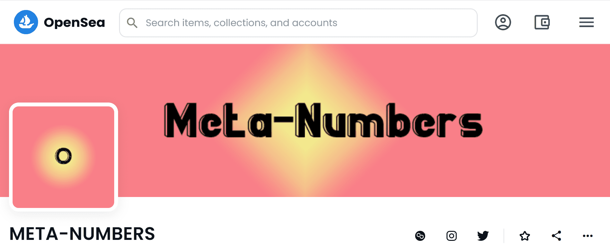

# META-NUMBERS

▶ 什么是元数字？
META-NUMBERS 是一个 NFT（不可替代令牌）集合。存储在区块链上的数字艺术品集合。
▶ 存在多少 META-NUMBERS 代币？
总共有 1,000 个 META-NUMBERS NFT。目前 2 位所有者的钱包中至少有一个 META-NUMBERS NTF。
▶ 最近卖出了多少 META-NUMBERS？
过去 30 天内售出 0 个元数字 NFT。

