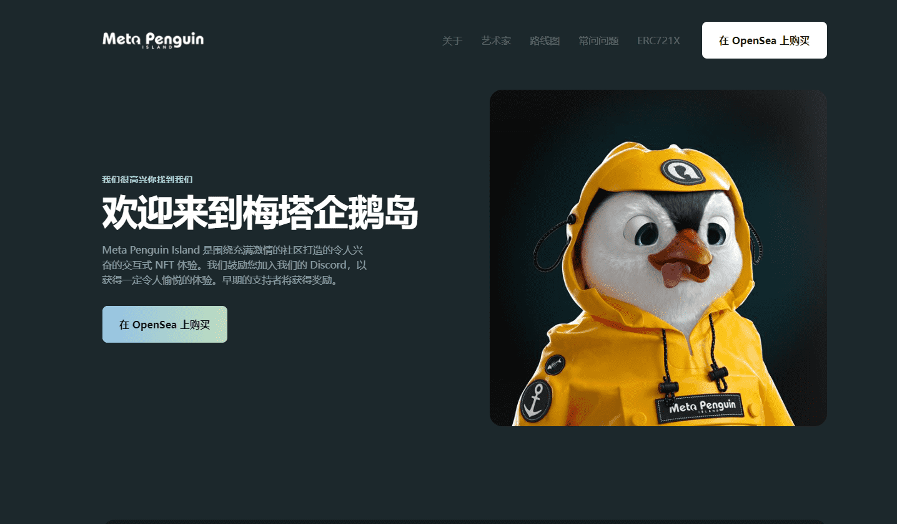

# Meta Penguin Island

Meta Penguin Island 是围绕充满激情的社区打造的令人兴奋的交互式 NFT 体验。

我们的系列包括 3,581 只独特的企鹅，按稀有程度分类，并以 4K 分辨率生成，包含数百种高质量、详细的元素。

Meta Penguin Island 是围绕充满激情的社区打造的令人兴奋的交互式 NFT 体验。我们鼓励您加入我们的 Discord，以获得一定令人愉悦的体验。早期的支持者将获得奖励。

Meta Penguin Island 是 8888 只独特企鹅的集合，按稀有程度分类，并以 4K 分辨率生成，包含数百个高质量、详细的元素。

存储为 ERC-721 代币，它们将存在于以太坊区块链上，因为它们与合法所有者一起进入元界。

