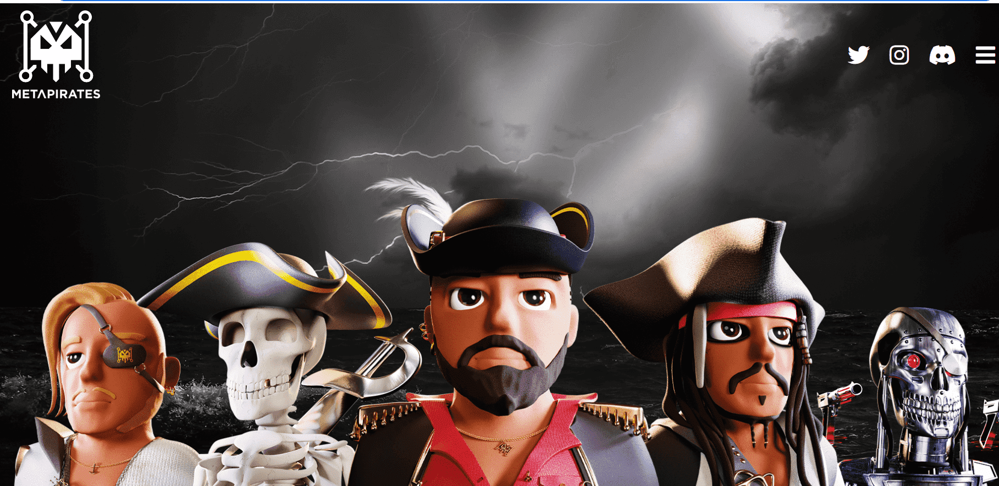

# Meta Pirates Project

Meta Pirates 是居住在以太坊区块链中的 8,888 个 NFT 独家海盗的私人收藏。

每件作品都是独一无二的 3D 艺术作品，包含 150 多个特征。我们的目标是创建一个强大的、雄心勃勃的社区——就像海盗一样——准备好与我们一起征服虚拟世界的陆地和海洋。

Meta Pirates 渴望与征服者的哲学联系起来。您将与团队中的每一位成员保持联系，每个人都拥有与您相同的愿景：抓住网络 3.0 的财富。

