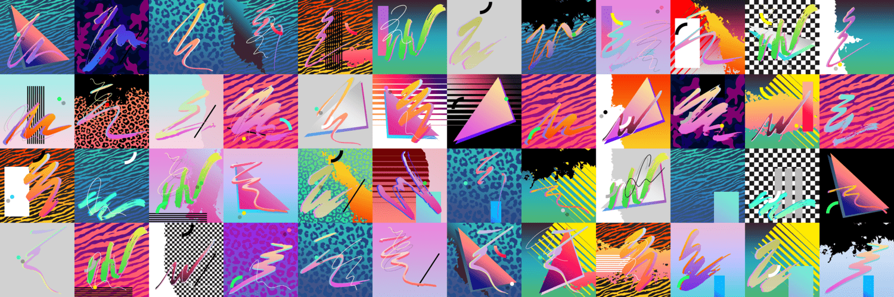

# Meta Retrowave

**元逆波**
Meta Retrowave 是一组随机生成的艺术作品，灵感来自 80 年代和 90 年代的平面设计流行文化。 每个布局都是使用 Verceighty 经典形状库制作的。

对于许多艺术家来说，童年是灵感的主要来源。对于法国艺术家皮埃尔·容格斯来说，青少年时期是他的主要主题。大约在这个年龄，艺术家们经历了一段相当艰难的时期，并开始逃入一个他从未真正经历过的年轻人所启发的幻想世界。

在深深沉浸于 80 年代的音乐和电影复兴之后，他对 Synthwave 运动着迷。这位艺术家决定将 80 年代和 90 年代的美学置于他创作的核心，从而在他的艺术实践中将这种合成的怀旧情绪外化。

他将老式色谱与基本形状和抽象图形设计相结合，揭示了一个令人回味的世界，一个过去时代的想象乌托邦。凭借这种发自内心的怀旧感，艺术家们旨在触及观众最私人的记忆和情感。

Pierre 在 90 年代和 2000 年代在巴黎西部长大后，在 ESAG Penninghen Paris 学习平面设计和艺术指导，并于 2016 年毕业。他在广告公司、BETC Paris 和 McCann Paris 担任了 4 年的创意艺术总监。作为艺术家出来。

