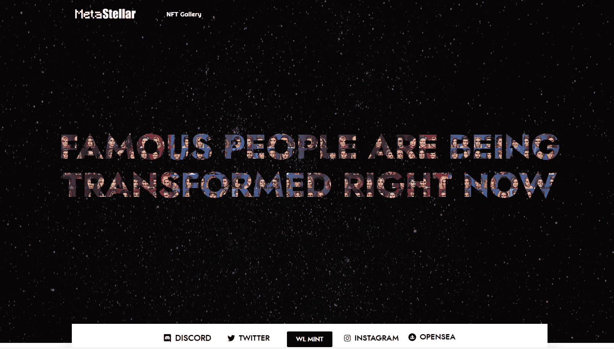

# Meta Stellar

强大的社区、令人讨厌的合同和所有铸币者 5% 的版税。

10,000 名地球上最有影响力和最有权势的人。由多层深度学习神经网络组成。

这一年是 2022 年，马斯克的 Starlink 项目已经完成。不好了！

发生了一些事情，Starlinks 的 AI 失控了。

它开始将地球上最有影响力和最有权势的人变成 NFT 像素角色，在数字世界 Metaverse 中捕捉他们。你准备好像素化一些人体细胞了吗？

