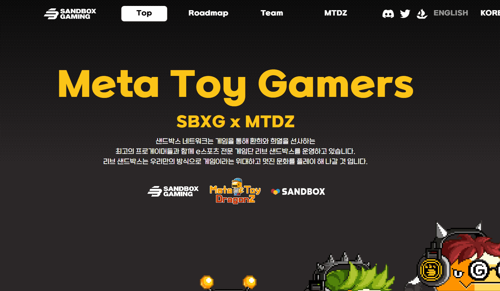

# Meta Toy Gamers

SBXG（沙盒游戏）的Meta Toy Gamers (MTG)是5,999 个 PFP NFT的集合，设计为Meta Toy 世界生态系统的成员，也是 Meta Toy DragonZ (MTDZ) 的衍生集合。SBXG旨在建立区块链游戏领域最强大的游戏玩家社区和电竞品牌之一。
MTG持有者将获得与游戏和电子竞技相关的各种线上和线下福利。DAO 团队治理和P2E 游戏公会等核心里程碑将通过进一步的路线图激活来展开。
加入 Meta Toy 游戏玩家。杀死你的游戏。

