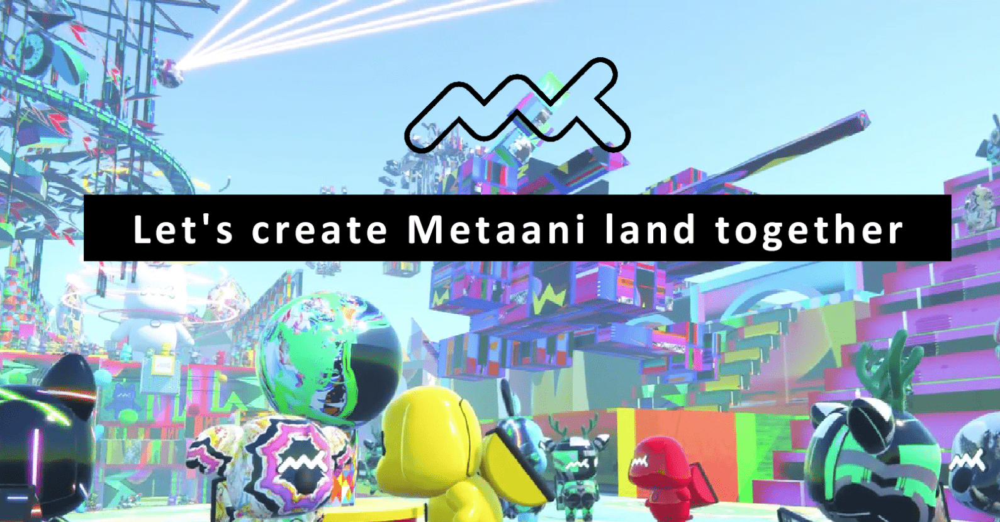

# MetaaniGEN

Metaani地是一个虚拟世界空间，可以由metaani化身加入。
面积将根据销售额的百分比扩大。
该项目的目标是在Me ta ni的土地上举办一个Metaani FES。

我们已经建立了自己的虚拟世界空间，metaani的土地。
创建和举办Metaani Fes，一个音乐和艺术节，与Me ta ni持有人一起。
我们的路线图目标是扩大metaani。

什么是 MetaaniGEN？

MetaaniGEN 是一个 NFT（不可替代代币）集合。存储在区块链上的数字艺术品集合。

存在多少 MetaaniGEN 代币？

总共有 1,356 个 MetaaniGEN NFT。目前 846 位所有者的钱包中至少有一个 MetaaniGEN NTF。

最昂贵的 MetaaniGEN 销售是什么？

售出的最昂贵的 MetaaniGEN NFT 是 [Metaani GEN#06403](https://www.nft-stats.com/asset/0xa467ab9447afa5db0c70325348d810d2058dde18/6403)。它于 2022-08-21（13 天前）以 209.6 美元的价格售出。

最近卖出了多少台 MetaaniGEN？

过去 30 天内售出了 6 个 MetaaniGEN NFT。

