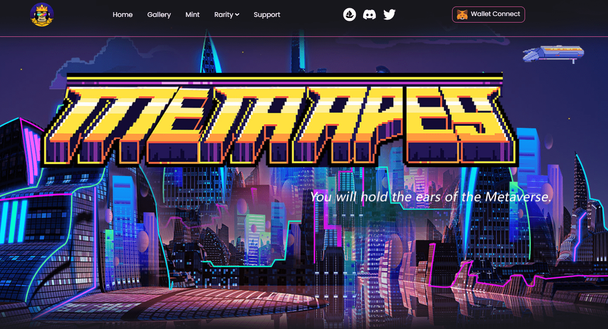

# MetaApes Club

MetaApes 是由 Metaverse Apes Club 独家生成的 99,999 个不可替代代币 (NFTS) 的集合。它们对我们的社区非常特别，并且将始终写在 Polygon 区块链上。您将能够在 Opensea 中购买和交易您的 MetaApes 资产。这些神奇的元猿具有各种特征。它们被定义为元宇宙的守护者，使它们在本质上非常独特和具有收藏价值。比如皇冠帽，它是所有收藏品中最珍贵的，一共只生产了103件。正如他们中的许多人所看到的，拥有它的人将在元宇宙中赢得战斗。此外，每一个特性都对应着一种增强或特殊的神力，这也是元宇宙中权力和地位的象征。为什么加入我们的俱乐部？因为它将在不断发展的 MetaApes Club 世界中赋予你专属的治理特权，MetaApes 将在未来 web3 的发展中衍生出更多的虚拟资产。请记住，我们热爱我们的社区，社区是独一无二的，并且在 Metaverse 空间中创造了历史。抓住你的元猿，就像珍惜自己的宝宝一样，不要失去它。

