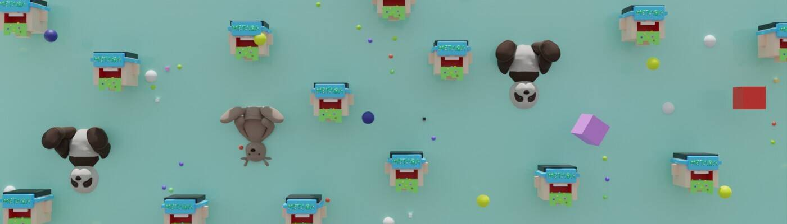

# METABA Sady

METABA 是一个 NFT 头像服务，提供 METABA 头像，即“多功能头像”，可以在 VRChat 和 Sandbox 等不同的元节中使用。通过使用METABA应用程序，用户可以通过添加配饰或更换衣服来定制自己的头像，其中稀有物品由艺术家和名人签名。
METABA - Sady Next Generation 是一个 NFT（不可替代令牌）集合。存储在区块链上的数字艺术品集合。
总共有 20 个 METABA - Sady Next Generation NFT。目前，13 位车主的钱包中至少有一个 METABA - Sady Next Generation NTF。

