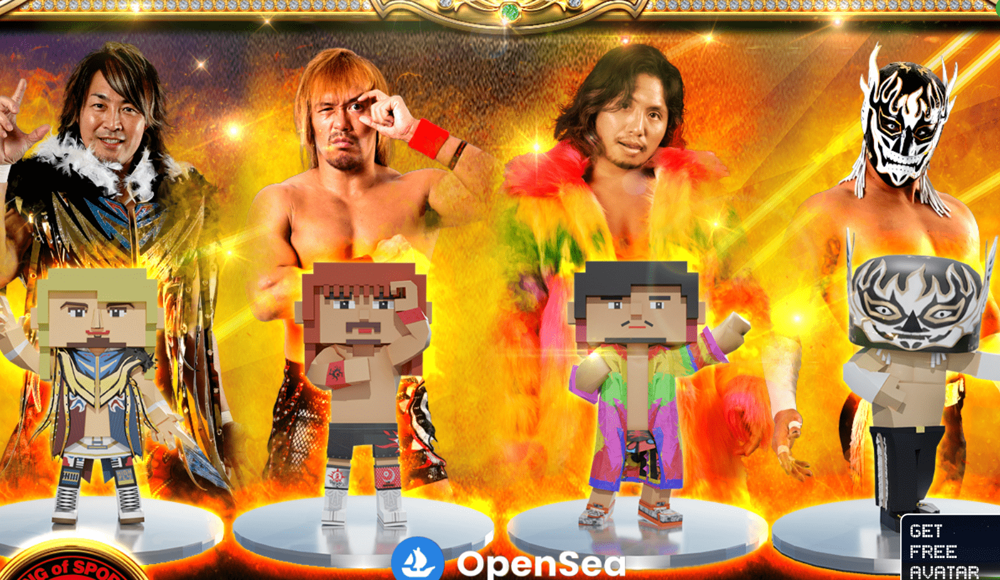

# METABA TESUTO

METABA NJPW NFT 在过去 7 天内售出 1 次。METABA NJPW 的总销售额为 658.68 美元。一份 METABA NJPW NFT 的平均价格为 658.7 美元。有 4 位 METABA NJPW 所有者，总共拥有 4 个代币。

METABA 是一个多用途的化身。通过在 METABA 官方页面链接钱包

您可以下载可用于各种虚拟世界和实用程序的头像数据。*支持的元节和实用程序：Cluster、animaze、VtubeStudio、3tene、VDRAW、Virtual Motion Capture、VRM Automatic Photography、TDPT

您可以换衣服和观看特别视频。 METABA-NJPW 头像为专属服装，无法更改。

METABA 是一个多用途的化身。当您将钱包链接到 METABA 官方页面时，您可以下载可与各种元界和实用程序一起使用的头像数据。

