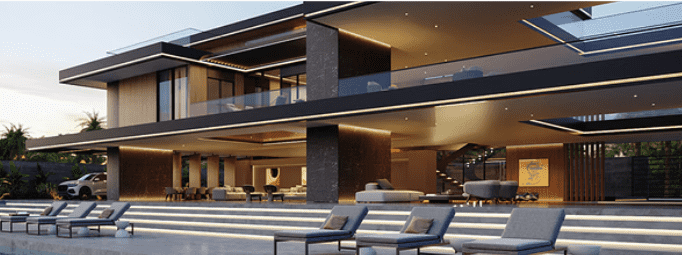

# Metabay by Metaplaces

Metabay 是 Metaverse 豪宅 NFT。拥有您的财产并过上 Metabay 的生活方式。以 3D 形式参观您的房子，邀请您的朋友并组织电影和迪斯科派对。定制您的内饰、家具和肖像。在您的 Metabay 中与朋友聚会。将您的 Metabay 链接到您的 Metaplaces 世界土地。

Metaplaces 属性有何独特之处？
每个 Metaplaces 属性都由 9 个独特的特征组成，这些特征加起来可以达到超过6,000,000 种独特的潜在组合：

财产类型：创世纪、传奇和通用
天空属性：晴朗，多云日落，极光，...
环境: 远山, 都市, 热带景观, …
庭院：夏季草坪、木甲板、混凝土、…
游泳池: 无泳池、绿松石无边泳池、蔚蓝长泳池、…
外墙：卡拉拉大理石、玛瑙黑、金色、……
外立柱：银白色、玛瑙黑、铬、……
内墙：松木、陈年木、Nero Portoro、……
车型和颜色：黑色 SUV、紫罗兰敞篷车、深色双门轿跑车……

