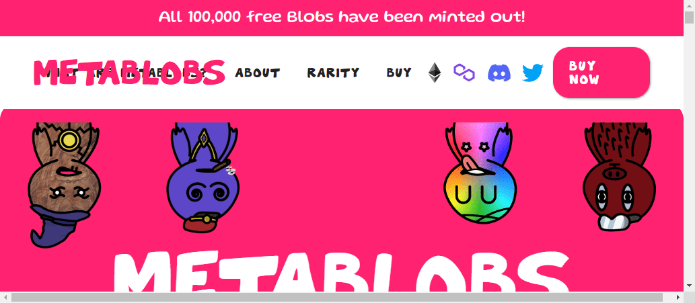

# MetaBlobs by OnchainForever

MetaBlobs 是一个 NFT 集合，它允许您为您和您的朋友铸造免费的 NFT。以太坊上有 10,000 个 MetaBlob 可用，Polygon 上有 90,000 个可用！我们有没有提到他们很酷？MetaBlob 是 CC0

MetaBlob 是可爱且独特的，适合所有人的免费 NFT！ 在以太坊区块链上免费铸造了 10,000 个 MetaBlob。 现在，Polygon 区块链上的 90,000 个 PolyBlob 也已全部铸造。 您仍然可以在 OpenSea 上获得 Blob！

为每个人提供 100,000 个免费 NFT
MetaBlob 很有趣。 而且很可爱。 其中有 100,000 个。 而且它们都是免费的，除了交易费。 MetaBlob 在这里可以享受、收集和交易。 它们提供了种类繁多的特征和无数的组合，因此真正有一个适合每个人的 MetaBlob。 所有 100,000 个 MetaBlob 都可用于铸造，并且任何地方都不存在秘密库存。 因此，立即获取您的免费 MetaBlob！

我们与社区一起决定将以太坊上的 MetaBlobs 供应量减少到 10,000 个。 此外，多边形上的 PolyBlobs 集合，剩余供应量为 90,000，此后推出。

