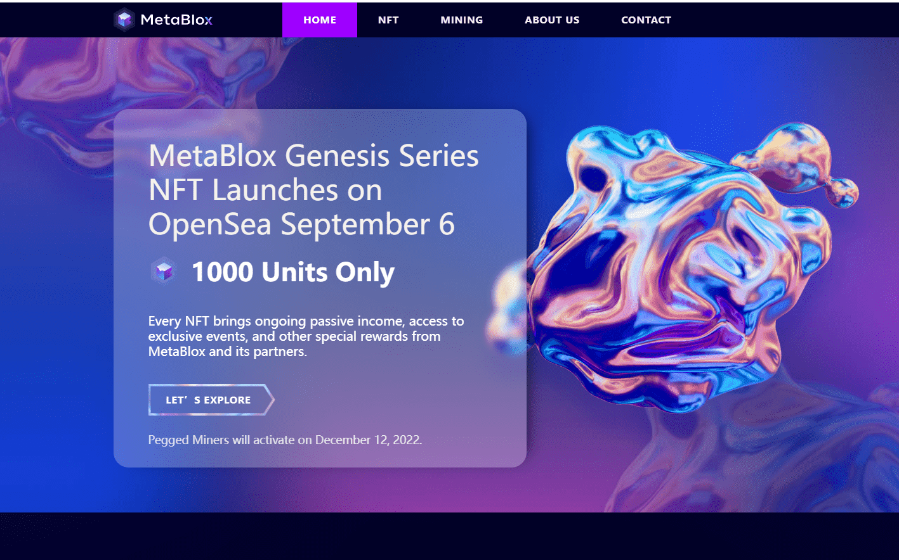

# MetaBlox Genesis Miner NFT

构建以用户为中心的分布式互联网！MetaBlox 是一个支持去中心化 ID 的网络，为 Web3 和元界提供关键构建块。

每个 NFT 都会带来持续的被动收入、独家活动的访问权以及来自 MetaBlox 及其合作伙伴的其他特殊奖励。

MetaBlox 网络挖掘是 WiFi 网络验证器和加密矿工之间的协作。挖矿奖励以 $MBLX 代币的形式分配。

对于去中心化互联网访问，MetaBlox 使用主区块链托管的智能合约来验证去中心化 ID (DID) 网络凭证。

