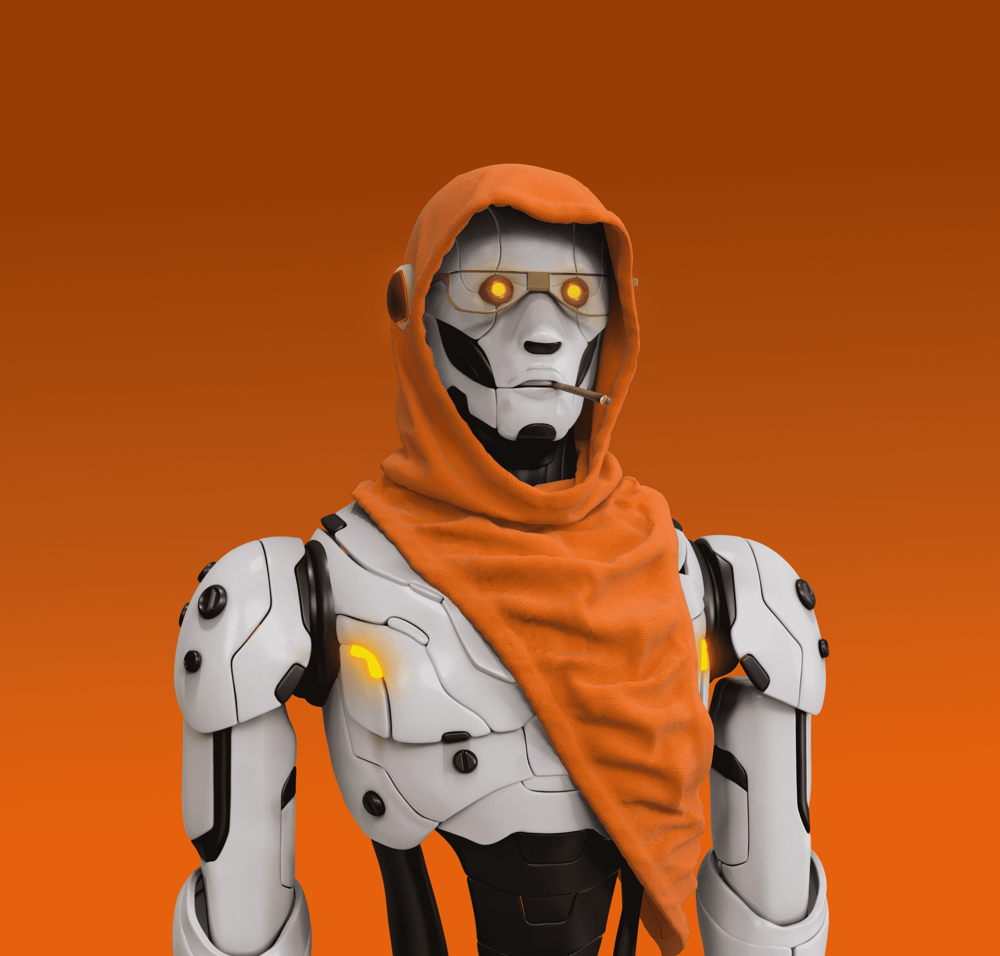

# METABOT SOCIETY OFFICIAL NFT

高度独家的 333 个独特 3D NFT 集合，展示了未来一代人形机器人或所谓的 METABOT 的时尚外观。第 2 季即将推出...

由 Netflix 热播剧“爱、死亡 + 机器人”背后的艺术家设计的 400 多个独特特征。

代谢植物协会（MBS）
是以太坊区块链上存储为 ERC-721 的仅 999 个 3D 独特 NFT 的集合； 具有最多样化的艺术特征，也为其持有者提供了宝贵的效用。

METABOT SOCIETY 项目是最独特的 NFT 项目之一，具有明确的路线图，得到企业家和高价值投资者的支持。

