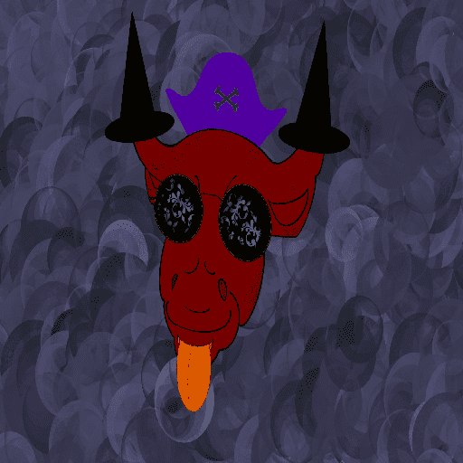

# MetaBullsClub

10000 总 MetaBull   9950 MetaBulls - 元界玩家    46 特殊背景 MetaBulls - Discord 和部落经理

4 SpecialBulls - 业主

MetaBullsClub NFT - 常见问题（FAQ）
▶ 什么是 MetaBullsClub？
MetaBullsClub 是一个 NFT（Non-fungible token）集合。存储在区块链上的数字艺术品集合。
▶ 有多少 MetaBullsClub 代币？
总共有 10,000 个 MetaBullsClub NFT。目前 6 位所有者的钱包中至少有一个 MetaBullsClub NTF。
▶ 最近卖出了多少 MetaBullsClub？
过去 30 天内售出 0 个 MetaBullsClub NFT。

