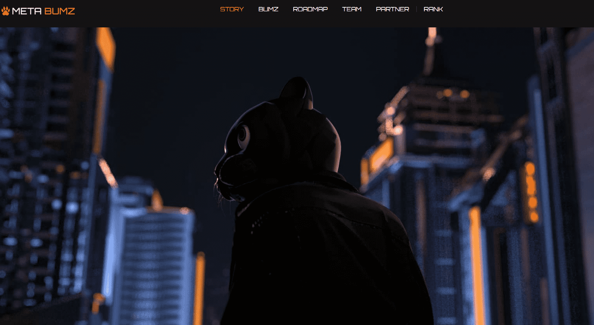

# METABUMZ-OFFICIAL

什么是 Meta Bumz NFT？

Meta Bumz NFT 是一个 NFT（不可替代令牌）集合。存储在区块链上的数字艺术品集合。

有多少 Meta Bumz NFT 代币？

总共有 9 个 Meta Bumz NFT NFT。目前有 2 位所有者的钱包中至少有一个 Meta Bumz NFT NTF。

最昂贵的 Meta Bumz NFT 销售是什么？

出售的最昂贵的 Meta Bumz NFT NFT 是 [Meta Bumz NFT #3615](https://www.nft-stats.com/asset/0x2953399124f0cbb46d2cbacd8a89cf0599974963/83400221159988769801730672366362817881616462234108065614465168657278648188929)。它于 2022-06-06（3 个月前）以 108.8 美元的价格售出。

最近卖出了多少 Meta Bumz NFT？

过去 30 天内售出了 1 个 Meta Bumz NFT NFT。

