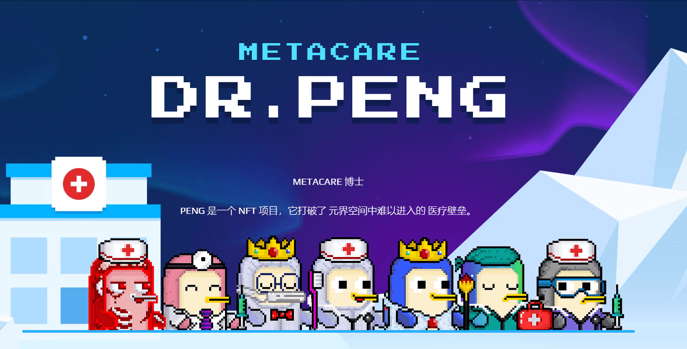

# Meta Care Dr.Peng

鹏博士项目通过与持有者的元社区，创造一个真正的社区，更进一步的是，出生在经济困难家庭的先天性残疾儿童，这些孩子接受无负担和有价值的治疗，让他们在社会中健康成长。一种 NFT，可为持有者增加和提供医疗福利。PENG 是一个 NFT 项目，它打破了 元界空间中难以进入的 医疗壁垒。

是不是已经很期待Meta Kongz和彭博士这次会有什么样的突破性动作了？10000 鹏博士的世界， 将是第一个具有医疗福利的NFT ，可以在我们附近以及虚拟空间中存在。K-NFT <博士。不要错过分享鹏计划历史时刻的机会> 。

