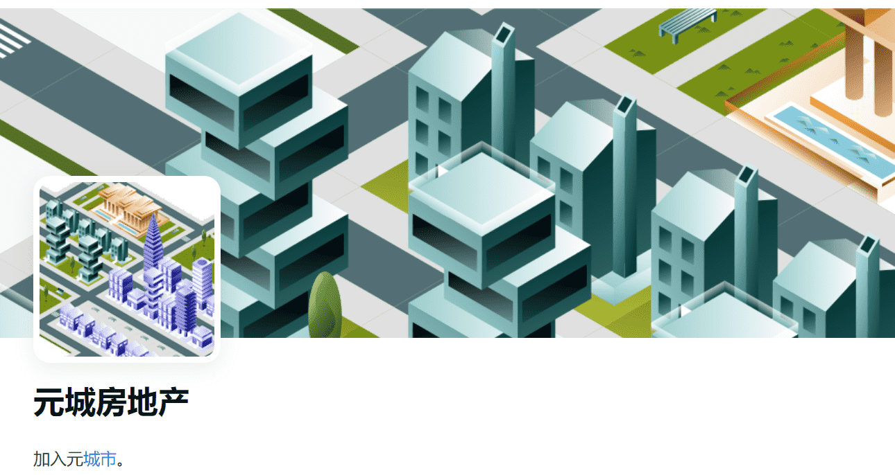

# MetaCity Real Estate

6500 人建造 MetaCity。加入我们，构建最大的基于 nft 的生态系统。

一个完全集成的 Web3 生态系统，HOTM 代币持有者将能够以越来越多的方式花费 $HOTM（我们专有的 ERC-20 代币）。

随着城市的发展为持有者提供长期价值和效用。

MetaTokyo 地区的土地将以 550 USDT 起售，价格根据与地标的接近程度而波动。

通过在我们的市场上交易或租用您的游戏内资产，将其转化。*房地产*狂潮随时开始！

