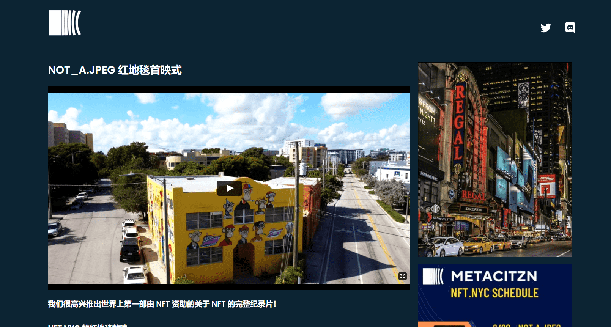

# METACITZNE

METACITZN 是一个以社区为重点的衍生 NFT 集合，包含 9,999 个稀有 Nft。

 每个 NFT 都是使用 140 多种属性（如帽子、眼睛、皮肤等等）的组合通过算法生成的！

 METACITZN 在以太坊 (ETH) 区块链上推出，以可承受的价格提供高质量的艺术品，同时执行广泛的路线图。

我们很高兴推出世界上第一部由 NFT 资助的关于 NFT 的完整纪录片！

我们很高兴再次展示我们与标志性 NFT 艺术家 GxngYxng 合作的作品——2022 年 6 月 21 日下午 2 点至晚上 9 点在纽约 Ghxsts 体验。

