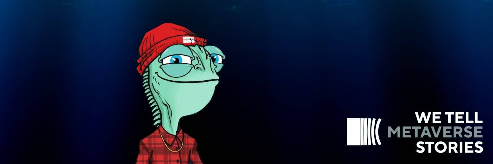

# METACITZNE

METACITZN 是一个以社区为重点的衍生 NFT 集合，包含 9,999 个稀有 Nft。每个 NFT 都是使用 140 多种属性（如帽子、眼睛、皮肤等等）的组合通过算法生成的！METACITZN 在以太坊 (ETH) 区块链上推出，以可承受的价格提供高质量的艺术品，同时执行广泛的路线图。

METACITZNE NFT - 常见问题（FAQ）
▶ 什么是METACITZNE？
METACITZNE 是一个 NFT（非同质代币）集合。存储在区块链上的数字艺术品集合。
▶ 有多少 METACITZNE 代币？
总共有 100 个 METACITZNE NFT。目前 2 位所有者的钱包中至少有一个 METACITZNE NTF。
▶ 最近卖出了多少METACITZNE？
过去 30 天内售出 0 个 METACITZNE NFT。

