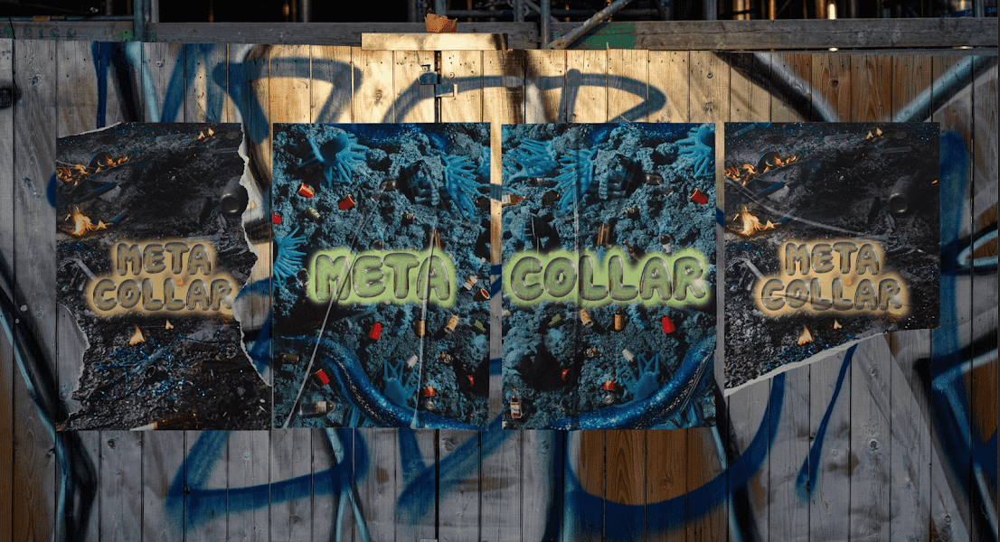

# MetaCollar Official

MetaCollar Official 是一系列独特的 Collar NFT——专注于工人阶级。您的 Collar NFT 作为您的会员专用通行证进入我们的下一代综合学习平台：CollarLearn。

我们的收藏家将获得独特而亲密的学习机会，与 Web3、加密、NFT、数字艺术、营销、体育和商业领域的一些最聪明的人一起学习。

MetaCollar 官方 NFT - 常见问题（FAQ）
▶ 什么是 MetaCollar 官员？
MetaCollar Official 是一个 NFT（Non-fungible token）集合。存储在区块链上的数字艺术品集合。
▶ 有多少 MetaCollar 官方代币？
总共有 1,561 个 MetaCollar 官方 NFT。目前，255 位所有者的钱包中至少有一个 MetaCollar 官方 NTF。
▶ MetaCollar Official 最近卖出了多少？
过去 30 天内共售出 0 个 MetaCollar 官方 NFT。

