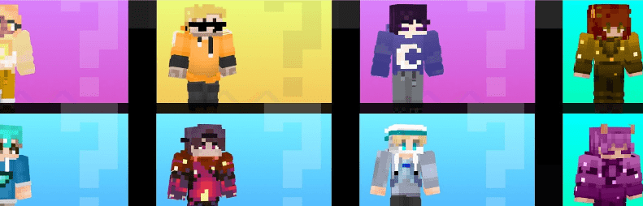

# MetacraftSkin: Crypto Constellations

这套皮肤的灵感来自 12 星座和加密社区的日常生活。它由 Metacraft 和 Showme 共同出版。穿上它，在 Metacraft 中与众不同。

MetacraftSkin：加密星座 NFT - 常见问题（FAQ）
▶ 什么是 MetacraftSkin：加密星座？
MetacraftSkin: Crypto Constellations 是一个 NFT（非同质代币）集合。存储在区块链上的数字艺术品集合。
▶ 存在多少 MetacraftSkin: Crypto Constellations 代币？
总共有 5,000 个 MetacraftSkin: Crypto Constellations NFT。目前，3,193 位所有者的钱包中至少有一个 MetacraftSkin: Crypto Constellations NTF。
▶ MetacraftSkin: Crypto Constellations 最近卖出了多少？
过去 30 天内售出了 0 个 MetacraftSkin: Crypto Constellations NFT。
▶ 什么是流行的 MetacraftSkin: Crypto Constellations 替代品？
许多拥有 MetacraftSkin: Crypto Constellations NFT 的用户还拥有 GoblinEgg.wtf、 PlayTiger、 BitBot Friends(POLY)和 Pee Boy NFT。

