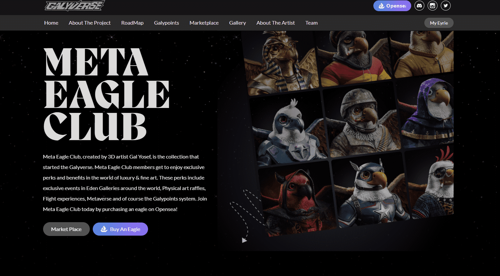

# Meta Eagle Club - Galyverse by Gal Yosef

Galyverse 是 3D 艺术家和数字雕塑家 Gal Yosef 的创意。虽然艺术是由 Gal 设想和创造的，但与 Galyverse EDEN Gallery 一起支持。- 世界知名的画廊，在纽约、伦敦、迈阿密、阿斯彭、迪拜、米科诺斯等地拥有奢华的展览空间。作为该项目的艺术合作伙伴。Galyverse 最初是作为一个存在 Gal 创作的世界而建立的，它首先是一个艺术世界，故事开始并创造了新角色。Meta Eagle Club 是在 Galyverse 中创建的第一个集合，由 12,000 个独特的 Meta Eagle NFT 组成 - 生活在以太坊区块链上的独特数字收藏品。Meta Eagle Club 的会员资格以持有 Meta Eagle Club NFT 为代表。

