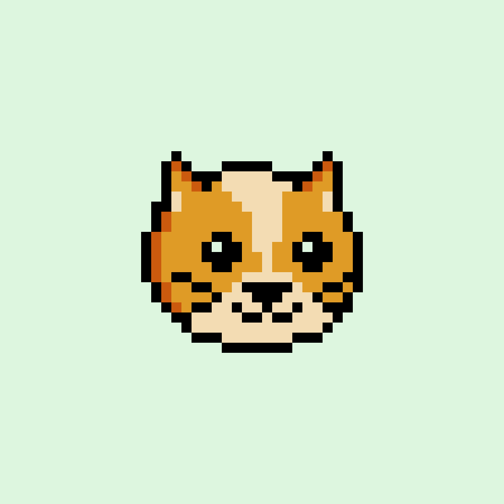

# MetaGochi Creatures

作为90后的孩子，追忆童年的光辉岁月，自然是我们最喜欢做的事情之一；CD、巨大的手机和生活在我们口袋里的小型电子宠物！那些日子……

其中一些时尚可能最好留在记忆中，但电子鸡在我们心中占有特殊的位置。虚拟世界每天都在进一步进入公众视野，我们希望站在它的最前沿，通过一个非常特殊的项目保证带您回到童年！

MetaGochi Creatures NFT - 常见问题（FAQ）
▶ 什么是 MetaGochi 生物？
MetaGochi Creatures 是一个 NFT（不可替代令牌）集合。存储在区块链上的数字艺术品集合。
▶ 存在多少 MetaGochi Creatures 代币？
总共有 5,428 个 MetaGochi Creatures NFT。目前，149 位所有者的钱包中至少有一个 MetaGochi Creatures NTF。
▶ 最昂贵的 MetaGochi Creatures 销售是什么？
售出的最昂贵的 MetaGochi Creatures NFT 是 #56 - King Kong Bundy。它于 2022-07-04（大约 2 个月前）以 22 美元的价格售出。
▶ 最近卖出了多少 MetaGochi Creatures？
过去 30 天内售出 1 个 MetaGochi Creatures NFT。

