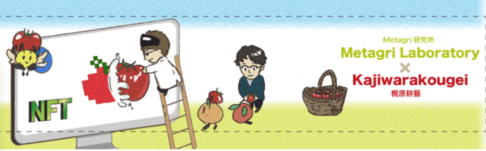

# Metagri-Labo Tomato Collection

Metagri-Labo Collection NFT - 常见问题（FAQ）
▶ 什么是 Metagri-Labo 系列？
Metagri-Labo Collection 是一个 NFT (Non-fungible token) 集合。存储在区块链上的数字艺术品集合。
▶ 有多少 Metagri-Labo Collection 代币？
总共有 40 个 Metagri-Labo Collection NFT。目前，29 位所有者的钱包中至少有一个 Metagri-Labo Collection NTF。
▶ 最昂贵的 Metagri-Labo Collection 销售是什么？
售出的最昂贵的 Metagri-Labo Collection NFT 是 Metagri.Farmer #0003。它于 2022 年 6 月 12 日（3 个月前）以 58.8 美元的价格售出。
▶ 最近卖出了多少 Metagri-Labo Collection？
过去 30 天内售出了 6 个 Metagri-Labo Collection NFT。
▶ 什么是流行的 Metagri-Labo Collection 替代品？
许多拥有 Metagri-Labo Collection NFT 的用户还拥有 abater collection、 Mado 作品、 FUWA ANAGO和 Eggbird garden。

