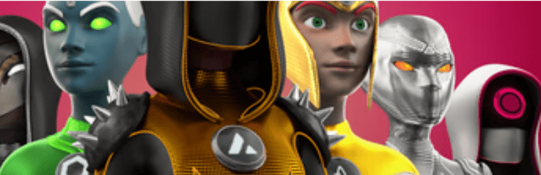

# Metaguardians: Sidekicks

Metavillains 是 10,000 个独特的 3D 反派化身的集合，作为 NFT 在区块链上生活。恶棍在以太坊区块链上存储为 ERC721 代币。

恶棍不仅是设计的人物收藏品，它们还可以作为您进入独家内容世界的门票。从开发新的系列来填充我们的宇宙，到虚拟世界的化身，当然还有我们即将推出的新 P2E 游戏！

MetaGuardians：恶棍 NFT - 常见问题（FAQ）
▶ 什么是 MetaGuardians：恶棍？
MetaGuardians：Villains 是一个 NFT（非同质代币）集合。存储在区块链上的数字艺术品集合。
▶ 有多少 MetaGuardians: Villains 代币？
总共有 10,000 个 MetaGuardians：Villains NFT。目前，2,354 位所有者的钱包中至少有一个 MetaGuardians: Villains NTF。
▶ 最昂贵的 MetaGuardians: Villains 特卖是什么？
最昂贵的 MetaGuardians: Villains NFT 是 Villain #977。它于 2022-08-05（24 天前）以 47.8 美元的价格售出。
▶ MetaGuardians：最近卖了多少反派？
过去 30 天内售出了 40 个 MetaGuardians：Villains NFT。
▶ MetaGuardians: Villains 需要多少钱？
在过去 30 天里，最便宜的 MetaGuardians: Villains NFT 销售额低于 17 美元，最高销售额超过 32 美元。MetaGuardians: Villains NFT 在过去 30 天内的中位数价格为 20 美元。
▶ 什么是流行的 MetaGuardians: Villains 替代品？
许多拥有 MetaGuardians 的用户：Villains NFT 还拥有 元界守护者、 亿万富翁 Coyote Cartel、 咆哮领袖和 皇家陶瓷俱乐部。

