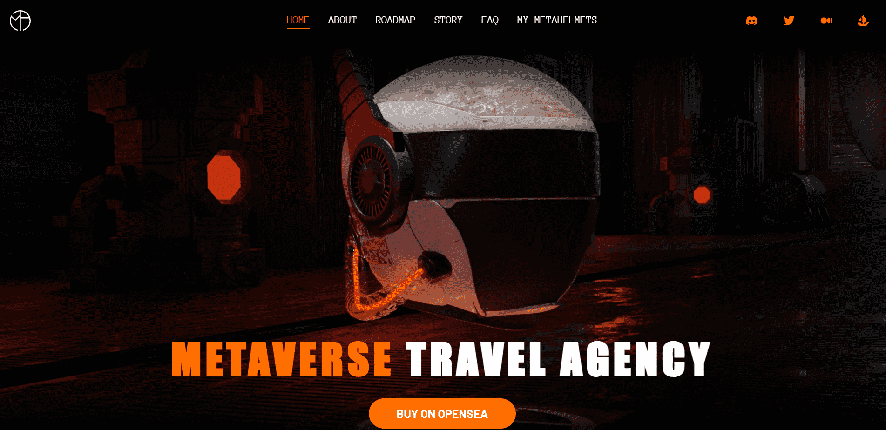

# Metaverse Travel Agency Metahelmet

Metaverse Travel Agency (MTA)正在以太坊区块链上开创下一代可穿戴 NFT。我们的第一个系列由 10,101 个随机组装的Metahelmets 组成。

每个Metahelmet都是独一无二的，但有些比其他的更罕见。铸造你的，加入一个致力于保护元宇宙的蓬勃发展的探索者社区：元宇宙。

每个Metahelmet都是独一无二的，由 100 多种可能的特征随机组合而成。每个 NFT 都存储为 ERC-721 令牌，并托管在 IPFS 上。

