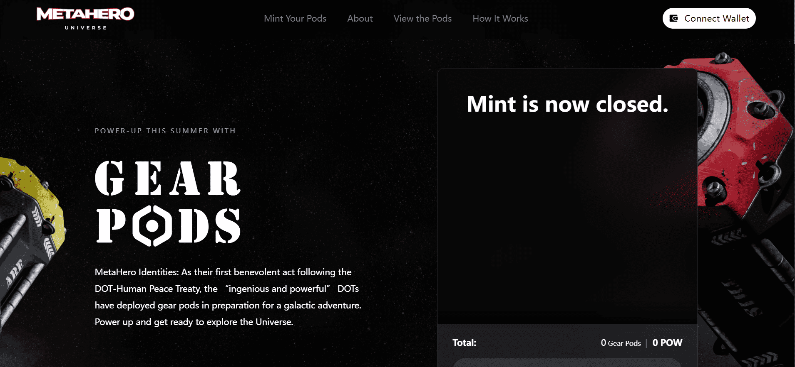

# MetaHero Gear Pods

MetaHero 身份：作为他们在 DOT-人类和平条约之后的第一个善举，“巧妙而强大”的 DOT 部署了齿轮箱，为银河冒险做准备。启动并准备好探索宇宙。

关于齿轮箱 根据和平条约第 1.3 条，DOT 正在向 MetaHeroes 部署关键补给，以进行星际合作探索。Gear Pod 内容稀有度将根据所持有的 MetaHero/Planet 对而有所不同。

最常见的，但你知道，仍然很好。Astral Gear Pod 可以通过不匹配的 MetaHero/Planet 对（例如，来自 Mercury 的 MetaHero 与 Pluto 配对）访问。

