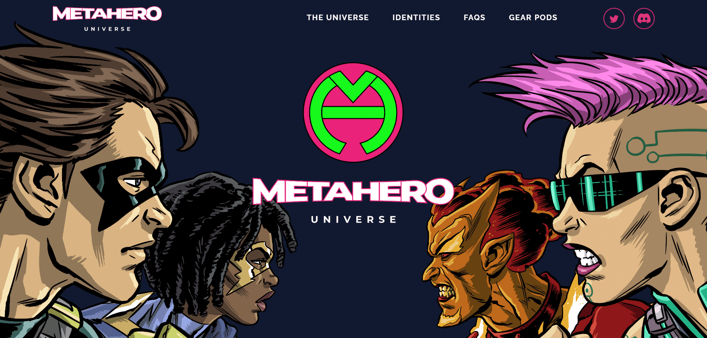

# MetaHero Universe: Generative Identities

MetaHero 身份的所在地，MetaHero Universe 由九个行星和一个卫星组成，由各自的行星 DAO 拥有和管理。每个行星代币代表行星 DAO 所有权的一小部分。作为一个社交和游戏平台，MetaHero Universe 将允许支持者不仅仅是持有者：社区将通过 United Planets DAO (UPDAO) 积极构建和管理宇宙，这是一个由每个行星 DAO 控制的中央 DAO。每个星球都有自己独特的互动环境，通过社区管理的土地销售、环境资源、可穿戴设备、游戏玩法等为 DAO 和玩家提供机会。

