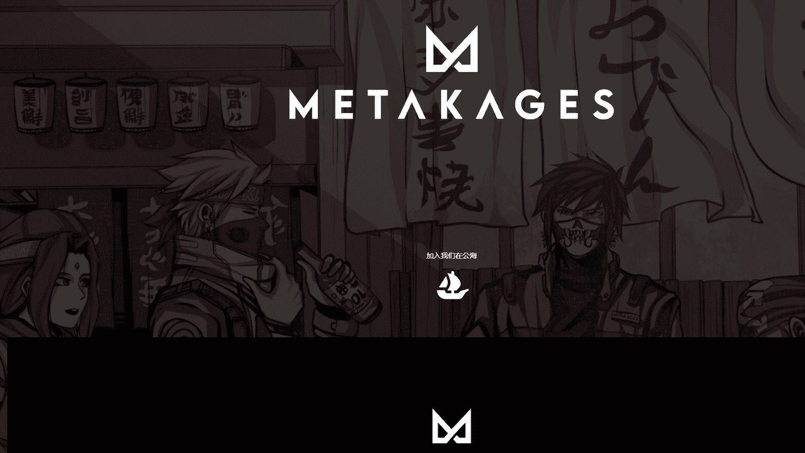

# Metakages Official

Metakages 是一个社区驱动的 NFT 项目，具有巧妙的优势。该系列包含 3,000 个具有静态和动画特征的独特头像。每个持有者都可以通过项目合作从强大的 NFT 工具应用程序、漫画和独家白名单访问中受益。Metakages 是一项通过加密振兴动漫社区的运动。

Opensea 持有人编号不包括 STAKED Metakages。

互联网上有一个为正义而战的小角落。这代表了正确的事情，并且共同创造了一个更美好的世界。‍ 居住在这个角落
的 ‍ 一起，‍ 在METAKAGES Elite NFT 协会，我们不仅仅是网络上的另一个项目。 ‍ 我们是 NFT 未来的代言人，我们决心教育和激励尽可能多的人。

