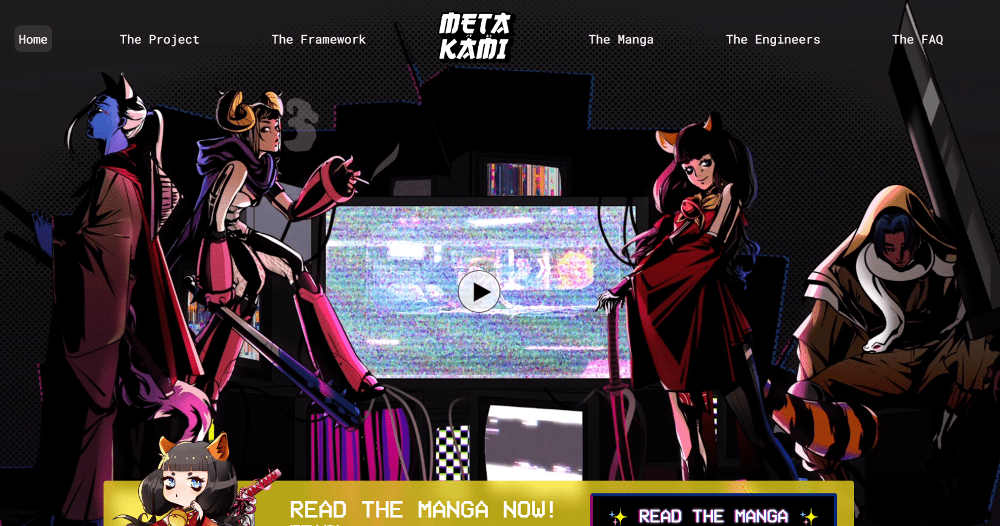

# METAKAMI: Enter the Void

元神是 3022 超现实中 3,333 个混合实体的集合。元神是融合神（神道神）和动物的物质化身。

它们的基因结构产生了地球上濒临灭绝的动物物种的本能，赋予了神一样的超自然能力来对抗所有威胁破坏自然的事物。由太阳女神激发，由社区提供支持。

我们的最后阶段销售已正式结束，我们代表整个团队感谢您对 METAKAMI 坚定不移的支持，我们迫不及待地想向您展示接下来几天会发生什么。

