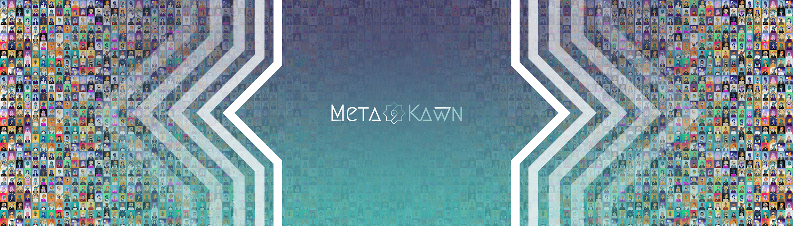

# MetaKawn Huffaz Club

发现真正的 NFT 收藏，代表下一代年轻穆斯林，以他们的身份和价值观为荣，由 6348 件多元化和平等的穆斯林艺术品组成。伊斯兰历史始于《古兰经》的启示，并由于一个保存《古兰经》和捍卫伊斯兰教崇高价值观的社区而得以延续。尊重价值守护者的这一概念，我们的首次发布是代表这些守护者的 6348 个化身的集合：MetaKawn Huffaz 俱乐部。Huffaz 持有者将在区块链上为 Mint 所有 6348 Ayat 的古兰经做出贡献。每个 Huffaz 持有者都将收到他在 Laylat Al Qadr（斋月的最后 10 天之一）期间贡献保存在区块链上的 Ayah 的 NFT 对于每个 Huffaz NFT，一个 Aya 将在最后 10 天被丢弃给其持有者斋月。

