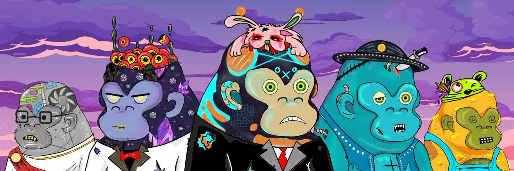

# MetaKongz Official Collection

METAKONGZ是 9 999 个 METAVERSE KONGZ NFT 的集合[。](https://metakongz.io/)

METAKONGZ 是独特的数字收藏品，作为 ERC-721 代币存储在以太坊区块链上并托管在 IPFS 上。

METAKONGS 也是一个 Mega DAO，它购买和分割 Cyberkongz、CryptoPunks 和更有价值的蓝筹 NFT 以分发给其成员。

此外，每个 METAKONG NFT 都授予对 DAO 独家社区的访问权限，以及对具有 100 多种手绘特征的 DAO 资产的投票权，每个 NFT 都是独一无二的，并拥有独家成功投资者群体的会员资格。METAKONGZ DAO 将为持有者提供对 NFT 投币、定期可索取的 NFT 以及更多未来实用程序的独家访问权。

我们坚信元界是未来，甚至在推出我们的 2D Genesis 之前，我们就已经在努力开发我们的 VX METAKONGZ 元界。

加入一个雄心勃勃、不断发展的社区，拥有多种福利和实用程序。

