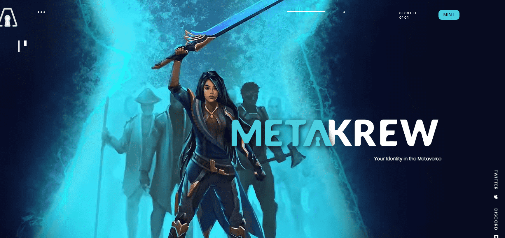

# Metakrew

Metakrew 是从 200 多个特征池中随机生成的 9750 个 pfp 化身的集合。

加载了 Metaverse 实用程序。Krew 代表 Metakey 社区的身份。

一个多元化且不拘一格的海盗和开拓者乐队，探索无限的虚拟世界。

元节中独特的风格表现非常强大；但 2D pfp 只是一个开始。每个 Krewmate 都会有一个从相同元数据生成的 3D 副本，插入到包括虚拟世界和游戏在内的无数空间中。它们将在这些空间中进一步定制，并在一代产品之上添加额外的配件。

