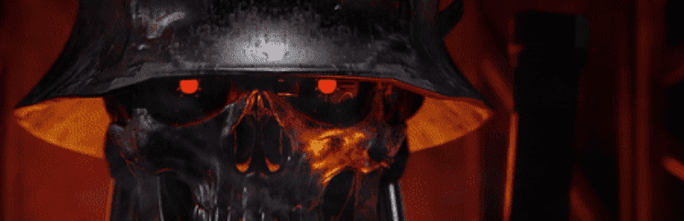

# MetalHeads

一组独特的控制论增强角色在永恒之城中展开激战。在这个反乌托邦的未来，人类已经接受了金属而不是肉体，通过强大的增强来改变他们的身体。

追求“源代码”的帮派兴起。在永恒之城统治的四个已知帮派是足利一族、艾森卫队、蒸汽帮和不洁者。

每个 MetalHeads NFT 都授予所有者参与 MetalHeads Universe 的特殊访问权限——从特殊掉落、为宇宙方向投票到被用作游戏角色！

MetalHeads NFT - 常见问题（FAQ）
▶ 什么是金属头？
MetalHeads 是一个 NFT（非同质代币）集合。存储在区块链上的数字艺术品集合。
▶ 有多少 MetalHeads 代币？
总共有 1,200 个 MetalHeads NFT。目前，477 位所有者的钱包中至少有一个 MetalHeads NTF。
▶ 什么是最昂贵的 MetalHeads 销售？
售出的最昂贵的 MetalHeads NFT 是 MetalHeads #99。它于 2022-08-25（3 天前）以 281.4 美元的价格售出。
▶ 最近卖出了多少台 MetalHead？
过去 30 天内售出了 4 个 MetalHeads NFT。

