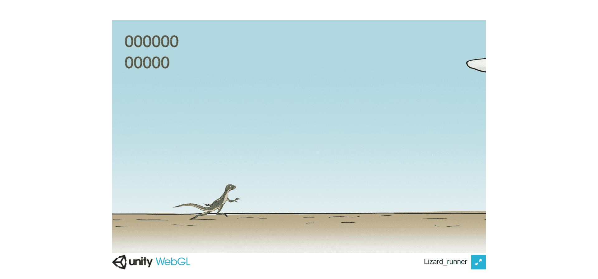

# MetaLizards Official

▶ 什么是 MetaLizards 官方？
MetaLizards Official 是一个 NFT（Non-fungible token）集合。存储在区块链上的数字艺术品集合。
▶ 存在多少 MetaLizards 官方代币？
总共有 4,444 个 MetaLizards 官方 NFT。目前，1,317 位所有者的钱包中至少有一个 MetaLizards 官方 NTF。
▶ 最昂贵的 MetaLizards 官方销售是什么？
MetaLizards Official NFT 售出的最昂贵的价格是 . 它于 2022-06-07（3 个月前）以 145.1 美元的价格售出。
▶ MetaLizards Official 最近卖出了多少？
过去 30 天内售出了 24 个 MetaLizards 官方 NFT。
▶ MetaLizards Official 的费用是多少？
过去 30 天，MetaLizards 官方 NFT 最便宜的销售额低于 35 美元，最高销售额超过 145 美元。过去 30 天内，MetaLizards 官方 NFT 的中位价格为 70 美元。
▶ 什么是流行的 MetaLizards Official 替代品？
许多拥有 MetaLizards 官方 NFT 的用户还拥有 Cyber Rabby、 Radioactive Balut、 Lil Blobs WRLD-GENESIS和 DivineWolfPups。

