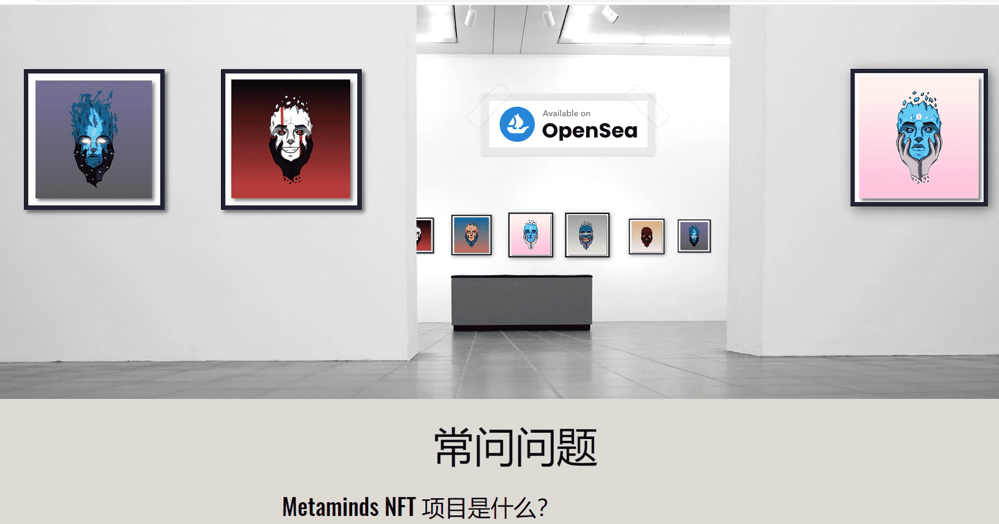

# Metaminds

Metaminds 是一个 NFT 集合，包含 1600 件不同稀有的独特生成艺术作品，作为 ERC-721 令牌存在于以太坊区块链上，艺术和元数据存储在 Arweave 上。

每个 Metamind 都是通过将数百个属性与以太坊区块链上的各种稀有性相结合而通过算法生成的。

您可以从 OpenSea 的二级市场购买 Metaminds NFT。

Metaminds 是一个艺术项目，希望能带来心理健康意识。

