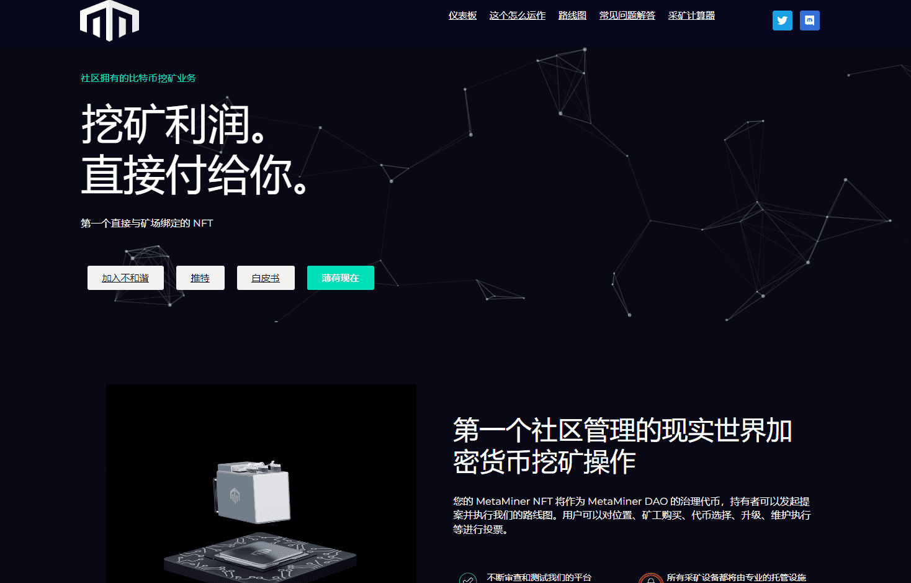

# MetaMiners NFT

您的 MetaMiner NFT 将作为 MetaMiner DAO 的治理代币，持有者可以发起提案并执行我们的路线图。用户可以对位置、矿工购买、代币选择、升级、维护执行等进行投票。

总共有 70% 的采矿利润将被推回持有者并累积在您的仪表板上，最终可索取。另外 20% 将用于社区 DAO 钱包，我们的 MetaMiner 持有者最终决定如何处理。剩下的 10% 将存入维护钱包，用于农场未来的任何维修或紧急情况，以保持其运行。

我们的 MetaMiner 持有者最终决定如何处理这个钱包。我们可以通过扩大我们的挖矿业务、购买其他蓝筹 NFT、举办社区派对甚至给持有者更多的奖励来投票保留资金并进行再投资。总的来说，关于我们可以用矿池共同做些什么，有无穷无尽的想法，但作为持有者，钱包里的利润是你的！

