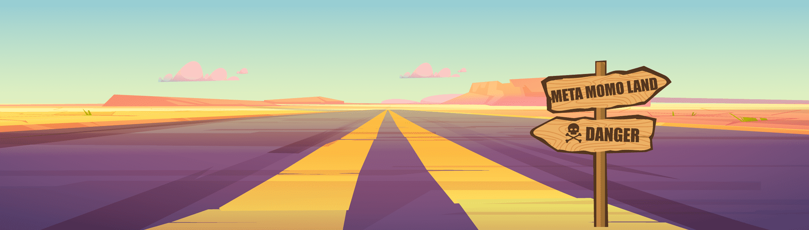

# META MOMO LAND V2

有很多年轻人从小就梦想成为艺术家（音乐、演员、画家、作家等）。

然而，为了开始艺术，你必须购买必要的设备或进入学费高昂的大学。有很多孩子因为需要钱而没有开始就放弃了。即使你成为一个成年人并从事艺术工作，也有许多成年人在与艺术家同时工作后放弃，因为在成名之前很难赚取大量收入。 

作家和策划者也梦想通过这样的经历成为艺术家。

Metagostrand 是为许多有抱负的艺术家和准明星计划和启动的，希望按照 Metagostrand 计划的路线图取得很大进展。

我希望这将是一家给他们力量的好公司。

