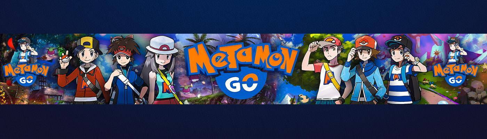

# Metamon Go Monsters

与朋友和好友 Metamon 一起在 Metaverse 中的任何地方捕捉和战斗。参与智能合约和赚取收益。所有元数据和图像都是 100% 在链上生成和存储的。

在购买的 NFT 土地上，玩家可以选择在自己的土地上建造体育馆，在那里他们可以组织 Metamon 战斗和锦标赛。要参加这些比赛，玩家必须支付入场费（以太坊），这将由健身房所有者决定。这对于身为健身房老板的玩家来说是一种赚大钱的方式，也就是累积钱的20%。比赛的获胜者还将获得如下收益：第一名的 40%，第二名的 20%，第三名的 10%，第四名的 6%，第五名的 s4%。

