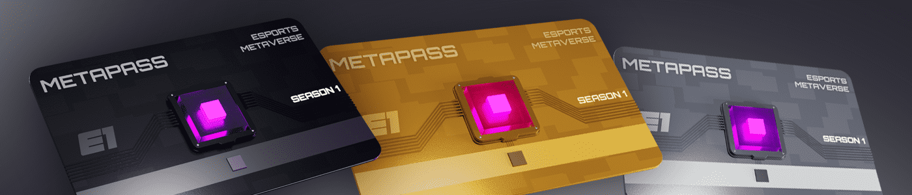

# Metapass Genesis

Metapass 是您进入 Metaverse 的通行证，代表了独立的实用 NFT，让持有者能够以前所未有的方式获得奖励、解锁访问权限并体验 web3 的未来。

Metapass Genesis NFT - 常见问题（FAQ）
▶ 什么是 Metapass Genesis？
Metapass Genesis 是一个 NFT（不可替代令牌）集合。存储在区块链上的数字艺术品集合。
▶ 存在多少 Metapass Genesis 代币？
总共有 3 个 Metapass Genesis NFT。目前，90,356 位所有者的钱包中至少有一个 Metapass Genesis NTF。
▶ 最昂贵的 Metapass Genesis 销售是什么？
出售的最昂贵的 Metapass Genesis NFT 是 Metapass Carbon。它于 2022 年 6 月 26 日（2 个月前）以 50.3 美元的价格售出。
▶ 最近卖出了多少台 Metapass Genesis？
过去 30 天内售出了 39 个 Metapass Genesis NFT。
▶ Metapass Genesis 需要多少钱？
在过去 30 天里，Metapass Genesis NFT 最便宜的销售额低于 2 美元，最高销售额超过 33 美元。Metapass Genesis NFT 在过去 30 天内的中位价格为 22 美元。
▶ 什么是流行的 Metapass Genesis 替代品？
许多拥有 Metapass Genesis NFT 的用户还拥有 Esports Arenas、 OneBot、 WVRPS Drops和 Smiless Collabs。

