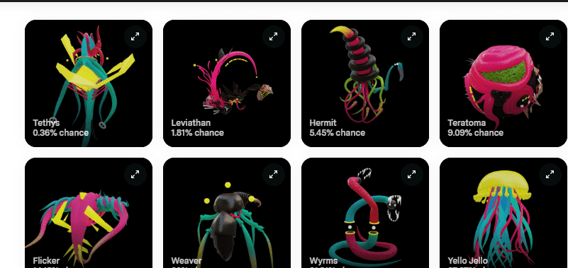

# Metaphyla by Metageist

作为一名从事佣金和社区项目的数字艺术家已有 20 年，Metageist 已成为一名全职加密艺术家，主要专注于使用虚拟现实工具创作稀有的数字艺术以在元宇宙中展示。他对梦想、身临其境的体验和看不见的自然世界感兴趣。他的梦想是创造完整的互动体验。他的首个 Nifty Gateway 系列带来了背包！有 275 包，每包 60 美元，这些都将飞。

由于 Metageist 的目标是创作用于在元宇宙中展示的艺术品，他创作了一些目前在 NFT 空间中最具互动性和沉浸感的艺术品。这与他色彩缤纷的小雕像风格相结合，使他的作品非常适合打包收藏。我们很高兴欢迎 Metageist 加入 Nifty Gateway，并希望很快能加入 3D 文件支持，让他能够继续他在 NG 上的沉浸式工作！

