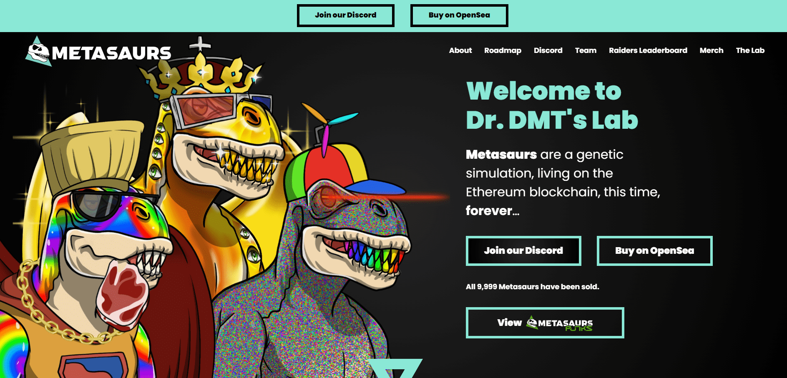

# Metasaurs by Dr. DMT

DMT 博士创建恐龙的MetaDNA实验，生活在以太坊区块链上，这一次，永远。
‍ 第一个杂交元龙物种：霸王龙(50%) X BAYC Ape #4588 (50 %)元宇宙的。

Metasaur 是由实验室中的DMT 博士根据 300 多个手绘特征计算机生成的，每个 Metasaur 由 4-7 个组合特征组成，具有各种稀有性。可能性是无穷无尽的，就像这些元龙在区块链上的无限寿命一样。

每个Metasaur都享有优先访问未来基因组合和 Metasaurs 物种的特权，并可以进入实验室，在那里您可以与我们的 Metasaurs 家族永远在一起。

